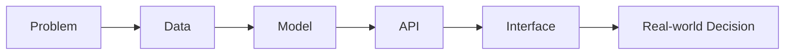

# ABHISHEK PAL // AI SYSTEMS ENGINEER

```text
AI SYSTEMS CONTROL ROOM
----------------------------------------------------------------
IDENTITY      Abhishek Pal
DOMAIN        Applied AI, computer vision, intelligent automation
LOCATION      Mumbai, India
MODE          Building products beyond notebooks
OBJECTIVE     AI / ML engineering opportunities with real-world impact
----------------------------------------------------------------
SIGNAL        Real-world data -> model inference -> useful decisions
```

I build intelligent systems that convert visual, audio, clinical, and user-behavior signals into decisions people can actually use.

My work sits at the intersection of machine learning, backend engineering, product interfaces, and deployment-minded experimentation. I have built systems for dynamic traffic control, real-time safety monitoring, clinical note automation, multimodal recommendation, and decision automation.

`COMPUTER VISION` `APPLIED AI` `REAL-TIME SYSTEMS` `PYTHON` `FLASK` `LLM APPS` `PRODUCT ENGINEERING`

---

## SYSTEM STATUS

```text
PRIMARY DOMAIN       Applied Artificial Intelligence
STRONGEST AREA       Computer Vision and inference workflows
ENGINEERING STYLE    Product-oriented experimentation
CURRENT FOCUS        Production-ready AI applications
OPERATING PRINCIPLE  Build systems people can actually use
```

- Research: AI-driven traffic signal management based on vehicle detection and priority
- Building: AI apps that connect models, APIs, interfaces, and user decisions
- Exploring: multimodal systems, real-time inference, healthcare AI, safety technology
- Open to: AI / ML engineering roles, internships, collaborations, and research-backed product work

---

## SYSTEMS I HAVE BUILT

### NeuralTraffic

**AI-driven dynamic traffic signal management system**

```text
INPUT       Vehicle detections
DECISION    Traffic density and priority
OUTPUT      Adaptive signal timing
STATUS      Published research
```

[Repository](https://github.com/Abhi951197/NeuralTraffic) | [Publication](https://www.routledge.com/Advances-in-Science-and-Technology/Sunnapwar-Chavan-Ansari/p/book/9781041303756)

`Computer Vision` `Vehicle Detection` `Traffic Optimization` `Research`

### Draupadi AI

**Real-time AI safety system for detecting distress situations**

```text
SENSE       Screams, keywords, crisis reports, location signals
DETECT      Potential distress events
RESPOND     Alerts, emergency workflows, hotspot context
STATUS      Deployed prototype
```

[Repository](https://github.com/Abhi951197/Draupadi_AI)

`Audio AI` `Flask` `Safety Tech` `Maps` `Emergency Workflows`

### MedScribe AI

**Clinical note automation and emergency triage assistant**

```text
LISTEN      Doctor-patient speech
EXTRACT     Medical context and red-flag symptoms
GENERATE    Clinical summaries and treatment support
ESCALATE    Emergency alerts for high-risk symptoms
```

[Repository](https://github.com/Abhi951197/MedScribe-AI)

`Generative AI` `ASR` `LLM Workflows` `Healthcare` `Python`

### Multimodal Recommender System

**Context-aware recommendation engine from text and image inputs**

```text
INPUT       Text queries and image-based signals
PARSE       NLP, POS tagging, semantic features
MATCH       Similarity search
OUTPUT      Movie, music, and book recommendations
```

[Repository](https://github.com/Abhi951197/MultiModal-Recommender-System)

`NLP` `Recommendation Systems` `Cosine Similarity` `Python`

### Wordle Unlimited Party

**Competitive word game with unlimited play, difficulty modes, and riddle hints**

```text
GAME LOOP   Guess, score, hint, compete
MODES       Multiple difficulty levels
STACK       TypeScript product build
ANGLE       AI-assisted multi-agent development workflow
```

[Repository](https://github.com/Abhi951197/Wordle-Unlimited-Party)

`TypeScript` `Game Logic` `Product Design` `AI-Assisted Development`

### SpinNdine

**Constraint-aware group dining decision engine**

```text
INPUT       Preferences, distance, cuisine, ratings
WEIGH       Practical constraints and group choices
DECIDE      One final recommendation
STATUS      Experimental product
```

[Repository](https://github.com/Abhi951197/spinNdine)

`TypeScript` `Decision Engines` `UX Logic`

---

## FROM EXPERIMENT TO SYSTEM



I am most interested in the part after model training: connecting inference, backend logic, interfaces, and user decisions into one working system.

---

## RESEARCH TRANSMISSION // 001

```text
TITLE      NeuralTraffic: An AI Driven Dynamic Traffic Signal
           Management System Based on Vehicle Detection and Priority
ROLE       Co-author
PUBLISHER  CRC Press / Taylor & Francis
BOOK       Advances in Science and Technology
YEAR       2026
DOMAIN     Computer Vision, Intelligent Transportation
```

[Read publication listing](https://www.routledge.com/Advances-in-Science-and-Technology/Sunnapwar-Chavan-Ansari/p/book/9781041303756)

---

## ENGINEERING STACK

```text
AI CORE
Python, Machine Learning, Computer Vision, NLP, Model Inference

SYSTEM LAYER
Flask, REST APIs, SQL, MySQL, backend workflows

INTERFACE
JavaScript, TypeScript, HTML, CSS, React-style product interfaces

ENGINEERING
Git, GitHub, Docker basics, deployment workflows, Linux basics
```

---

## BUILD TIMELINE

```text
2024  Built early hackathon and web projects
2025  Shipped applied AI prototypes and production-facing systems
2026  Published NeuralTraffic research
      Building safety, healthcare, recommender, and game products
NEXT  AI engineering role with measurable real-world impact
```

---

## GITHUB TELEMETRY

<p>
  
  
</p>

<p>
  
</p>

---

## CURRENT SIGNALS

```text
ONLINE        Applied AI systems
PUBLISHED     NeuralTraffic
DEPLOYED      Draupadi AI prototype
BUILDING      Healthcare and decision-support AI products
EXPLORING     Multimodal and real-time inference systems
```

---

## CONNECT

- LinkedIn: [abhishek-pal-0677ab2a3](https://www.linkedin.com/in/abhishek-pal-0677ab2a3)
- Email: [cabhishekpal@gmail.com](mailto:cabhishekpal@gmail.com)
- GitHub: [Abhi951197](https://github.com/Abhi951197)

```text
TRANSMISSION END
----------------------------------------------------------------
Build systems. Measure outcomes. Keep shipping.
```
