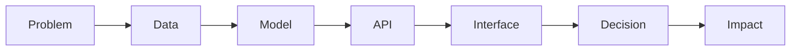

<p align="center">
  
</p>

<p align="center">
  <a href="https://git.io/typing-svg">
    
  </a>
</p>

<p align="center">
  <a href="mailto:cabhishekpal@gmail.com"></a>
  <a href="https://www.linkedin.com/in/abhishek-pal-0677ab2a3"></a>
  <a href="https://github.com/Abhi951197"></a>
</p>

<p align="center">
  
  
  
</p>

---

## SYSTEM CORE

<table>
  <tr>
    <td width="55%">

<pre>
IDENTITY      Abhishek Pal
MODE          AI systems control room
LOCATION      Mumbai, India
DOMAIN        Applied AI + Computer Vision
OBJECTIVE     AI / ML engineering opportunities
SIGNAL        Real-world data -> inference -> decisions
</pre>

I build intelligent systems that convert visual, audio, clinical, and user-behavior signals into practical decisions.

My work connects machine learning models with APIs, interfaces, and workflows, because the real magic starts when a model becomes a usable product.

  </td>
  <td width="45%">

<pre>
ONLINE       Applied AI systems
PUBLISHED    NeuralTraffic
DEPLOYED     Draupadi AI prototype
BUILDING     Healthcare AI workflows
EXPLORING    Multimodal inference
</pre>

  </td>
  </tr>
</table>

---

## TECH RADAR

<p align="center">
  
</p>

```text
AI CORE        Python, Machine Learning, Computer Vision, NLP, Model Inference
SYSTEM LAYER   Flask, REST APIs, SQL, MySQL, backend workflows
INTERFACE      JavaScript, TypeScript, HTML, CSS, React-style interfaces
ENGINEERING    Git, GitHub, Docker basics, deployment workflows, Linux basics
```

---

## FEATURED SYSTEMS

<table>
  <tr>
    <td width="50%">
      <h3>NeuralTraffic</h3>
      <p><b>AI-driven dynamic traffic signal management.</b></p>
      <pre>Vehicle detections -> density + priority -> adaptive timing</pre>
      <p>
        <a href="https://github.com/Abhi951197/NeuralTraffic">Repository</a> |
        <a href="https://www.routledge.com/Advances-in-Science-and-Technology/Sunnapwar-Chavan-Ansari/p/book/9781041303756">Publication</a>
      </p>
      <p><code>Computer Vision</code> <code>Traffic Optimization</code> <code>Research</code></p>
    </td>
    <td width="50%">
      <h3>Draupadi AI</h3>
      <p><b>Real-time AI safety system for distress detection.</b></p>
      <pre>Screams + keywords + reports -> alerts + hotspot context</pre>
      <p><a href="https://github.com/Abhi951197/Draupadi_AI">Repository</a></p>
      <p><code>Audio AI</code> <code>Flask</code> <code>Safety Tech</code> <code>Maps</code></p>
    </td>
  </tr>
  <tr>
    <td width="50%">
      <h3>MedScribe AI</h3>
      <p><b>Clinical note automation and emergency triage assistant.</b></p>
      <pre>Speech -> summary -> treatment support -> red-flag alerts</pre>
      <p><a href="https://github.com/Abhi951197/MedScribe-AI">Repository</a></p>
      <p><code>Generative AI</code> <code>ASR</code> <code>Healthcare</code> <code>Python</code></p>
    </td>
    <td width="50%">
      <h3>Multimodal Recommender</h3>
      <p><b>Context-aware recommendations from text and image inputs.</b></p>
      <pre>Text/image query -> NLP features -> similarity matching</pre>
      <p><a href="https://github.com/Abhi951197/MultiModal-Recommender-System">Repository</a></p>
      <p><code>NLP</code> <code>Recommendation Systems</code> <code>Similarity Search</code></p>
    </td>
  </tr>
  <tr>
    <td width="50%">
      <h3>Wordle Unlimited Party</h3>
      <p><b>Competitive word game with unlimited play and riddle hints.</b></p>
      <pre>Guess -> score -> hint -> compete</pre>
      <p><a href="https://github.com/Abhi951197/Wordle-Unlimited-Party">Repository</a></p>
      <p><code>TypeScript</code> <code>Game Logic</code> <code>Product Design</code></p>
    </td>
    <td width="50%">
      <h3>SpinNdine</h3>
      <p><b>Constraint-aware group dining decision engine.</b></p>
      <pre>Preferences + distance + cuisine + rating -> one decision</pre>
      <p><a href="https://github.com/Abhi951197/spinNdine">Repository</a></p>
      <p><code>TypeScript</code> <code>Decision Engine</code> <code>UX Logic</code></p>
    </td>
  </tr>
</table>

---

## RESEARCH TRANSMISSION

<p align="center">
  
</p>

```text
TITLE      NeuralTraffic: An AI Driven Dynamic Traffic Signal
           Management System Based on Vehicle Detection and Priority
ROLE       Co-author
PUBLISHER  CRC Press / Taylor & Francis
BOOK       Advances in Science and Technology
YEAR       2026
DOMAIN     Computer Vision, Intelligent Transportation
```

---

## BUILD PIPELINE



<p align="center">
  
</p>

---

## GITHUB SIGNALS

<p align="center">
  
  
</p>

<p align="center">
  
</p>

<p align="center">
  
</p>

---

## ACTIVITY GRID

<p align="center">
  
</p>

---

## CURRENT MISSION

```text
BUILD          Production-ready AI applications
STUDY          Robust inference, multimodal systems, computer vision
IMPROVE        Repositories with demos, screenshots, and architecture notes
COLLABORATE    AI / ML projects with measurable real-world impact
```

<p align="center">
  
</p>

<p align="center">
  
</p>
